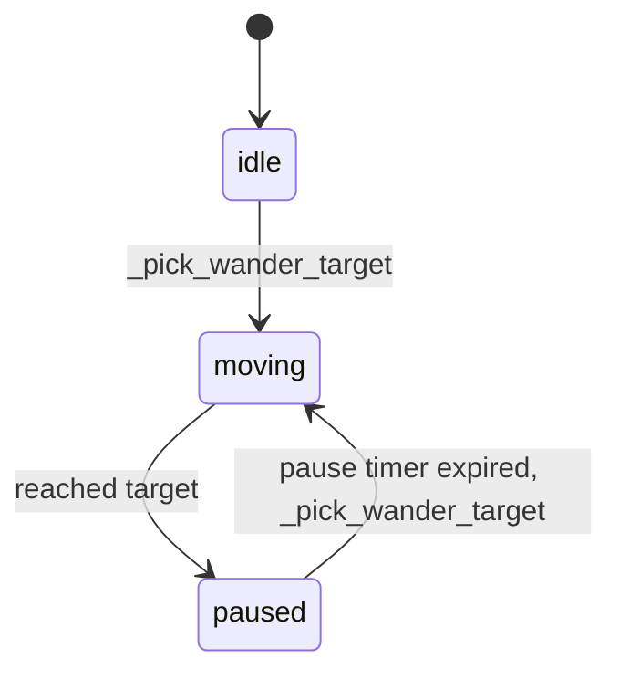

# Unicorn Wander Feature — Implementation Plan

## Overview

Add a `wander` method to the `Unicorn` class that makes the unicorn move organically around the screen. The unicorn picks a random target point, moves toward it at a steady speed, pauses briefly on arrival, then picks a new target. Sleep need slows the unicorn down, and the sprite flips horizontally based on movement direction.

## Design

### State Machine

The wander behavior uses a simple three-state machine:



| State | Description |
|-------|-------------|
| `idle` | Initial state before wandering begins. Transitions to `moving` on first `wander` call. |
| `moving` | Unicorn moves toward `wander_target` at `_get_wander_speed` px/sec. Transitions to `paused` when within a small threshold of the target. |
| `paused` | Unicorn stands still for a random duration of 1–3 seconds. On expiry, picks a new target and transitions to `moving`. |

### Key Parameters (class constants)

| Constant | Value | Purpose |
|----------|-------|---------|
| `WANDER_SPEED` | `50` | Base wander speed in pixels per second |
| `WANDER_PAUSE_MIN` | `1.0` | Minimum pause duration in seconds |
| `WANDER_PAUSE_MAX` | `3.0` | Maximum pause duration in seconds |
| `WANDER_ARRIVAL_THRESHOLD` | `5` | Distance in pixels to consider target reached |
| `WANDER_MARGIN` | `10` | Pixel margin from screen edges for target selection |
| `WANDER_SLEEP_SPEED_FACTOR` | `0.25` | At max sleep need, speed is reduced to 25% of base |

### Instance Variables (added to `__init__`)

| Variable | Type | Initial Value | Purpose |
|----------|------|---------------|---------|
| `wander_state` | `str` | `'idle'` | Current state in the wander state machine |
| `wander_target` | `pygame.Vector2 or None` | `None` | Target position to move toward |
| `wander_pause_timer` | `float` | `0.0` | Countdown timer for pause state |
| `wander_bounds` | `tuple` | `(800, 600)` | Screen width/height for boundary clamping |
| `original_image` | `pygame.Surface` | copy of `self.image` | Unflipped sprite for directional flipping |
| `facing_right` | `bool` | `True` | Current facing direction |

### Methods

#### `_pick_wander_target(self) -> pygame.Vector2`
Selects a random point within screen bounds minus `WANDER_MARGIN`. Returns a `pygame.Vector2`.

#### `_get_wander_speed(self) -> float`
Returns the effective wander speed. Formula:
```
sleep_factor = 1.0 - (self.sleep_need / MAX_NEED_VALUE) * (1.0 - WANDER_SLEEP_SPEED_FACTOR)
return WANDER_SPEED * sleep_factor
```
At `sleep_need = 0` → full speed (50 px/s). At `sleep_need = 100` → 25% speed (12.5 px/s).

#### `wander(self, delta_time: float)`
Main wander logic called each frame from `update`. Handles state transitions:
- **idle**: Pick first target, transition to `moving`.
- **moving**: Calculate direction vector to target, normalize, multiply by `_get_wander_speed * delta_time`, move `self.rect`. Flip sprite if direction changes. If within `WANDER_ARRIVAL_THRESHOLD` of target, transition to `paused` with a random timer.
- **paused**: Decrement `wander_pause_timer` by `delta_time`. When expired, pick new target and transition to `moving`.

#### Sprite Flipping Logic
Store the original unflipped image in `self.original_image`. When the unicorn moves left (negative x direction), flip the image horizontally using `pygame.transform.flip`. Track direction with `self.facing_right` to avoid flipping every frame.

### Integration Points

#### [`Unicorn.update()`](src/entities/unicorn.py:91)
Add `self.wander(delta_time)` call after the existing need decay logic.

#### [`Unicorn.__init__()`](src/entities/unicorn.py:30)
Add new instance variables for wander state, and store `self.original_image` after the sprite is created.

#### [`settings.py`](src/settings.py:1)
The screen dimensions `WIDTH = 800, HEIGHT = 600` are already defined. The unicorn can import these or receive bounds as a parameter. Passing bounds as a parameter to `__init__` is cleaner to avoid circular imports.

#### [`PlayingState.__init__()`](src/states.py:26)
Optionally pass `wander_bounds=(WIDTH, HEIGHT)` to the Unicorn constructor, or set `self.unicorn.wander_bounds = (WIDTH, HEIGHT)` after creation.

## Files to Modify

| File | Changes |
|------|---------|
| [`src/entities/unicorn.py`](src/entities/unicorn.py) | Add wander constants, instance variables, `_pick_wander_target`, `_get_wander_speed`, `wander` methods, sprite flip logic, integrate into `update` |
| [`src/states.py`](src/states.py) | Pass screen bounds to unicorn (minor) |

## Dependencies

- `random` module (stdlib) — for `random.uniform` and `random.randint`
- `pygame.Vector2` — already available via pygame
- `pygame.transform.flip` — for horizontal sprite flipping
